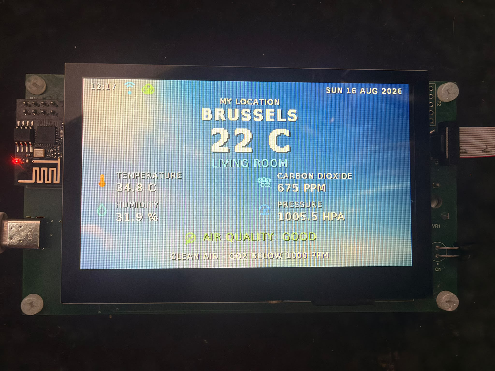
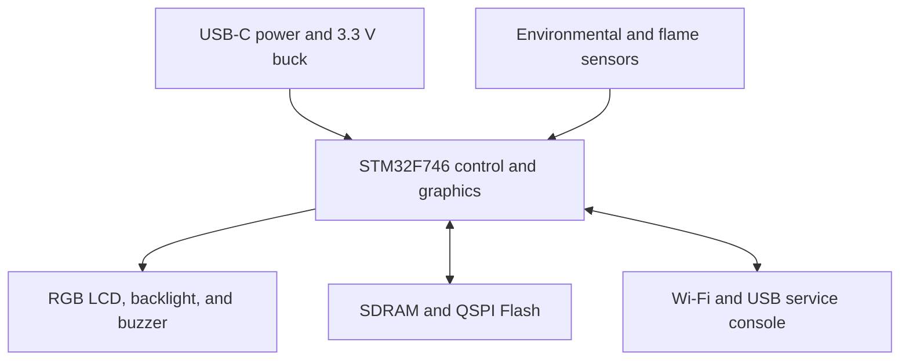
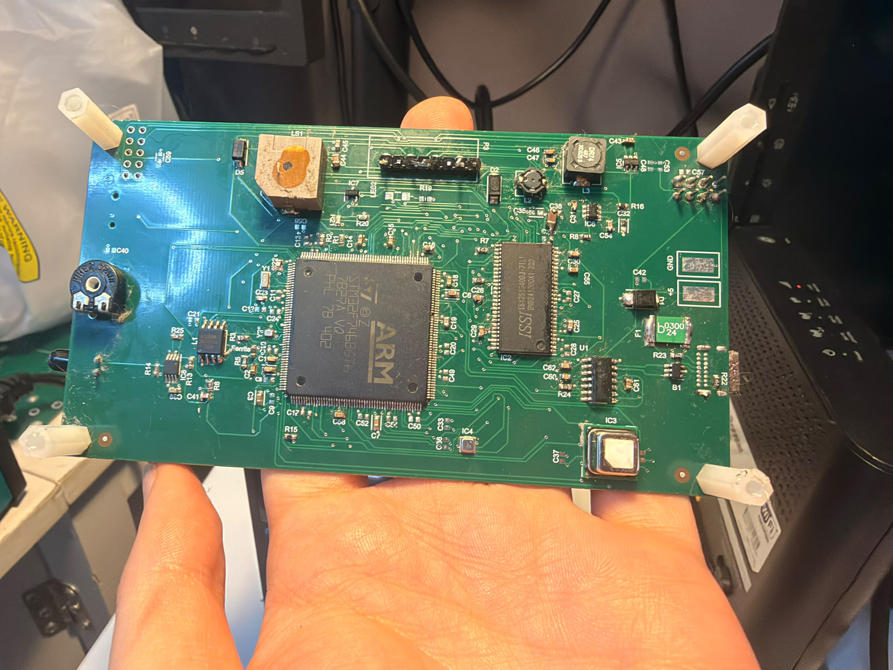
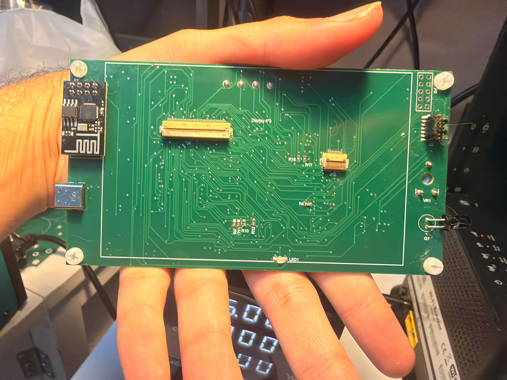
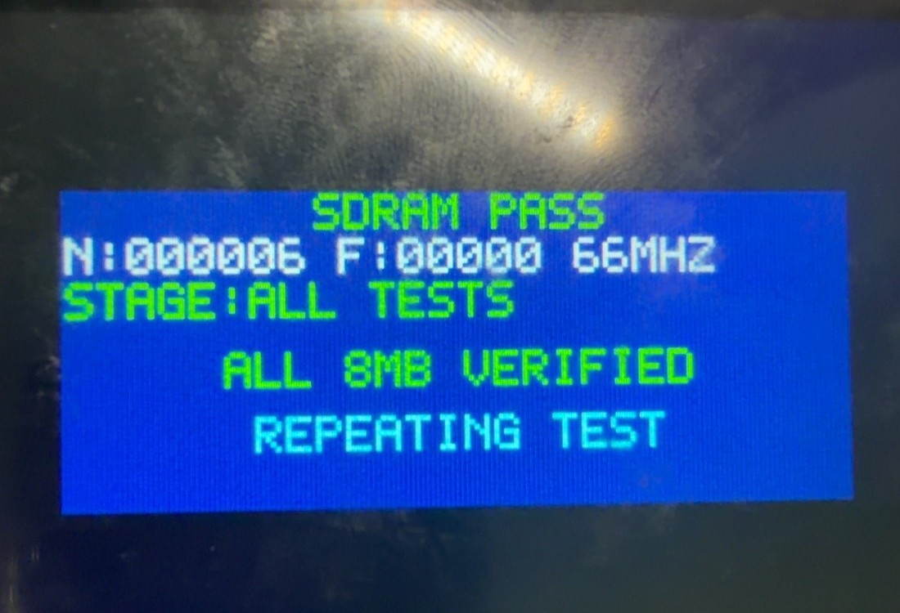

# STM32F746 Smart Home Hub

<p align="center">
  
</p>

<p align="center">
  <strong>A custom embedded platform for environmental monitoring, local visualization, alarms, USB diagnostics, and Wi-Fi connectivity.</strong>
</p>


The Smart Home Hub is a manufactured and assembled Advanced PCB course project built around the STM32F746BGT6. It combines a 4.3-inch RGB display, external SDRAM and QSPI Flash, environmental sensing, an optical flame front end, an audible alarm, ESP-01/Blynk connectivity, and an MCP2221A USB service console on one custom PCB.

The repository contains the native Altium design, a dated manufacturing-output snapshot, the final recovered application sources and GUI assets, test evidence, technical documentation, and the presentation.

> [!IMPORTANT]
> This is an educational laboratory prototype. It is not a certified smoke, flame, gas, carbon-monoxide, or life-safety detector and must not replace approved safety equipment.

## System overview



| Subsystem | Implementation | Role |
|---|---|---|
| Main controller | STM32F746BGT6 | Acquisition, graphics, alarms, memory, and communications |
| Local interface | 4.3-inch 480×272 RGB LCD | Live dashboard and priority warning screens |
| Working memory | IS42S16400J, 8 MB SDRAM | Double-buffered graphics and temporary data |
| Asset storage | W25Q128JV, 16 MB QSPI NOR Flash | Persistent backgrounds, fonts, and icons |
| Environmental sensors | SCD41 and BME688 | CO₂, temperature, humidity, pressure, and relative gas-resistance diagnostics |
| Optical warning input | PT334-6B + LMV393 | Analog flame/IR response and active-low digital threshold |
| Connectivity | ESP-01 + Blynk | Wi-Fi telemetry and laboratory weather/time retrieval |
| Service interface | MCP2221A on USART3 | USB virtual COM-port diagnostics and commands |
| Power | USB-C, protected 5 V input, AP63203 3.3 V buck | Local power entry, protection, and regulation |
| Backlight | TPS61165 boost current driver | Constant-current LCD backlight control |

## Verified prototype status

These are observed bench results from the final Rev 2.1 report, not calculated targets.

| Test | Result | Evidence / note |
|---|---:|---|
| 5 V input and AP63203 3.3 V rail | **PASS** | Rails are present; the board and core peripherals operate. Fuse-trip and TVS-clamp stress tests were not documented |
| STM32 boot and SWD programming | **PASS** | Firmware programs and runs |
| RGB LCD and backlight | **PASS** | Stable image after correcting the boost-diode orientation |
| SCD41 | **PASS** | CO₂ plus temperature/humidity using a 9.3 °C installation-specific sensor offset |
| BME688 | **PASS** | Pressure, gas resistance, and diagnostics acquired |
| Flame analog/digital path | **PASS** | ADC and active-low comparator output respond |
| Buzzer driver | **PASS** | Controlled by the STM32 and silent during reset |
| ESP-01, Blynk, and outdoor data | **PASS** | AT, Wi-Fi, TCP, Blynk, and weather/time path demonstrated |
| W25Q128 QSPI | **PASS** | JEDEC ID `EF 40 18`; stored assets verified |
| IS42S16400 SDRAM | **PASS** | Full 8 MB repeatedly verified at approximately 66 MHz |
| MCP2221A USB-UART | **PASS** | Enumerates and exchanges bidirectional USART3 traffic after D+ path repair |
| GT911 capacitive touch | **NOT TESTABLE** | The display assembly's external touch flex is mechanically torn |

The current BME688 source learns 60 valid samples, then triggers only when gas resistance remains at or below 55% of baseline for six samples (about 30 seconds); it clears at or above 75% for six samples. This is only a relative air-change indicator. A calibrated gas identity, ppm result, or end-to-end gas-triggered safety response was not validated.

<p align="center">
  
  
</p>

## Why two external memories?

- **QSPI Flash is persistent storage.** It keeps the GUI backgrounds, fonts, icons, metadata, and checksums when power is removed.
- **SDRAM is fast working memory.** It stores the live framebuffers and temporary graphics data, but loses its contents after power-off.

The final GUI draws into an inactive SDRAM buffer and swaps the LTDC address during vertical blanking. This removes whole-screen flashing while QSPI supplies the reusable visual assets.

<p align="center">
  
</p>

## Repository layout

```text
.
├── firmware/
│   ├── Core/                 Final recovered application and asset sources
│   ├── Assets/               Weather artwork used to generate QSPI content
│   ├── Tools/                Asset-generation and preview scripts
│   └── Reference/            SDRAM diagnostic and dated legacy CubeMX files
├── hardware/
│   ├── altium/               Native schematic, PCB, OutJob, CAM, and smart PDF
│   └── manufacturing/        Dated Gerber, drill, BOM, PnP, and DRC snapshot
├── docs/
│   ├── report/               Rev 2.1 technical report in DOCX and PDF
│   ├── presentation/         Editable project presentation
│   ├── firmware-guide/       Firmware code guide in DOCX and PDF
│   └── configuration/        Legacy V0–V12 Blynk export
└── media/                    README photographs, diagrams, and validation images
```

See [`firmware/README.md`](firmware/README.md) for source integration and QSPI installation, and [`hardware/README.md`](hardware/README.md) for the Altium and manufacturing packages.

## Firmware integration

The final recovered package contains the application layer, QSPI/GUI assets, the MCP2221A console, configuration files, asset tools, and diagnostics. It does **not** contain the complete generated CubeIDE `Drivers/` tree, linker/startup files, or the Bosch `bme68x` driver that existed in the working local project. Therefore, this repository is **not buildable as-is**, and the integration steps below are not a verified reproducible build.

1. Generate or open an STM32CubeIDE project for `STM32F746BGTx`.
2. Integrate the files from `firmware/Core/Inc` and `firmware/Core/Src`.
3. Add the Bosch BME68x SensorAPI files used by the existing application.
4. Copy `firmware/Core/Inc/app_secrets.h.example` to `app_secrets.h` and enter local credentials. Never commit that file.
5. Review the final verified FMC/LTDC settings in the report before regenerating code.
6. Follow the QSPI workflow in `firmware/README.md`; the longer weather/asset guide is retained as a clearly marked historical reference.
7. Flash through SWD/ST-LINK, then verify the service console, memory tests, sensors, display, and network path.

The dated IOC under `firmware/Reference/legacy-cubemx/` is retained only as a pin-allocation reference. It predates the final verified SDRAM timing and must not be treated as a turnkey final configuration.

## USB service console

The MCP2221A exposes USART3 at **115200 8N1**. Available commands include:

- `PING` — verifies the complete PC ↔ USB ↔ MCP2221A ↔ STM32 round trip.
- `STATUS` — summarizes memory, sensor, network, and alarm state.
- `SENSORS` — prints live SCD41, BME688, gas, and flame values.
- `NETWORK` — reports ESP-01, Wi-Fi, Blynk, location, and weather state.
- `MEMORY` — reports SDRAM and QSPI state.

## Design notes and limitations

- **Touch:** the GT911 path is unavailable because the external display flex is torn; the operating dashboard does not depend on touch.
- **Location and time:** the recovered final `main.c` is fixed to Brussels for the displayed city and weather request. Its UTC offset is also fixed at `+7200` seconds, so Belgian winter time will display one hour fast unless the firmware is updated for DST. It does not provide GPS-level positioning.
- **Gas channel:** BME688 gas resistance is interpreted relative to a learned baseline. It cannot identify a gas or report validated concentration.
- **Optical flame channel:** sunlight, lamps, and other infrared sources can affect the phototransistor.
- **SCD41 compensation:** the configured 9.3 °C offset is installation-specific and must be recalibrated if enclosure, airflow, display heating, or sensor placement changes.
- **Networking:** the working ESP-01 path uses plain HTTP as a laboratory compatibility workaround; it is not a production security design.
- **Validation scope:** no claim is made for formal sensor calibration, long-duration reliability, EMC, or electrical-safety certification.
- **Archived DRC:** the preserved 17 July 2026 report records 55 detected violations, two waived violations, and a modified-polygon warning. Repour polygons and run a fresh, clean DRC before any new fabrication order.
- **Layer-count discrepancy:** the Rev 2.1 report and presentation describe a four-layer PCB, but the recovered native `PCB1.PcbDoc` master stack and preserved Gerbers are definitively two-copper-layer data. This README follows the source evidence; the four-layer documentation claim is stale.
- **Design archives:** the Altium project references external integrated libraries that were not present in the recovered archive. The native documents are included, but the project is not self-contained.
- **BOM metadata:** the archived BOM/PnP set is historically useful and reference-designator complete, but several value/description/MPN fields conflict. Verify every procurement field against the schematic, assembled board, and component datasheet.
- **Buzzer documentation:** the Rev 2.1 narrative describes a 5 V buzzer rail and 100 kΩ gate pull-down, while the recovered schematic/BOM show 3.3 V and 10 kΩ. Verify the assembled revision before relying on either description.
- **USB schematic divergence:** the compiled MCP2221A/USBLC6 sheet contains D− and VUSB connections that do not represent a valid USB path. The reworked prototype enumerated after a D+ repair, so the archived drawing is not a reliable as-built record. Trace the physical board and correct the Altium source before reproducing this section.
- **Manufacturing data:** no IPC-2581 file or STEP model was present in the recovered project files. The archived Gerber/drill set is traceability evidence only, not a release-ready package for a new order.
- **Compiled schematic:** the Altium smart PDF contains embedded JavaScript and vendor-link actions. Open it only in a trusted viewer with active content disabled, or export a flattened PDF from Altium before wider distribution.

Do not test the alarm using dangerous gas exposure or uncontrolled flame. Use independently powered, certified detectors for real protection.

## Documentation

- [Technical Report — Rev 2.1 (PDF)](docs/report/Smart_Home_Hub_Technical_Report_Rev2.1.pdf)
- [Technical Report — Rev 2.1 (DOCX)](docs/report/Smart_Home_Hub_Technical_Report_Rev2.1.docx)
- [Firmware Code Guide — historical snapshot (PDF)](docs/firmware-guide/Smart_Home_Hub_Firmware_Code_Guide.pdf)
- [Project Presentation (PPTX)](docs/presentation/Smart_Home_Hub_Presentation.pptx)
- [Compiled Schematic PDF](hardware/altium/Hub_Unit%20-%20Copy.pdf)
- [Canonical Blynk V0–V16 definition](firmware/BLYNK_DATASTREAMS.md)

## Security

Real Wi-Fi and Blynk credentials are intentionally excluded. Keep `app_secrets.h` local and rotate any credentials that were ever stored in an older project archive. The current laboratory firmware sends the Blynk token and telemetry over unencrypted HTTP; a failed ESP-01 echo-disable command can also expose the Wi-Fi join command in debug output. Do not use production credentials with this firmware.

---

Built as an Advanced PCB educational project; Rev 2.1 documentation dated 16 August 2026.
